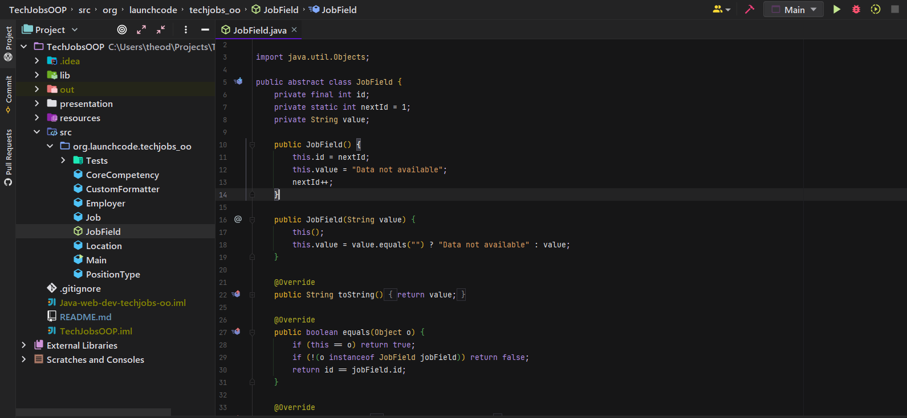
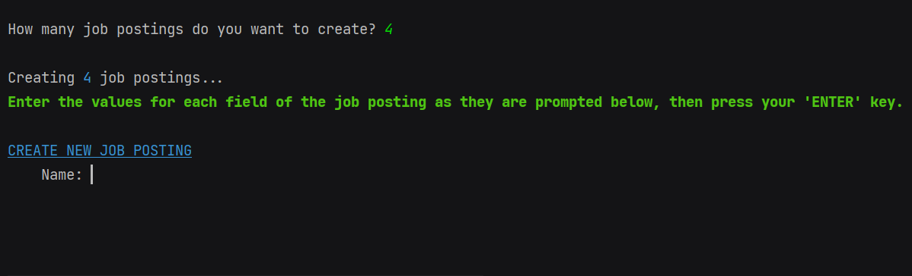
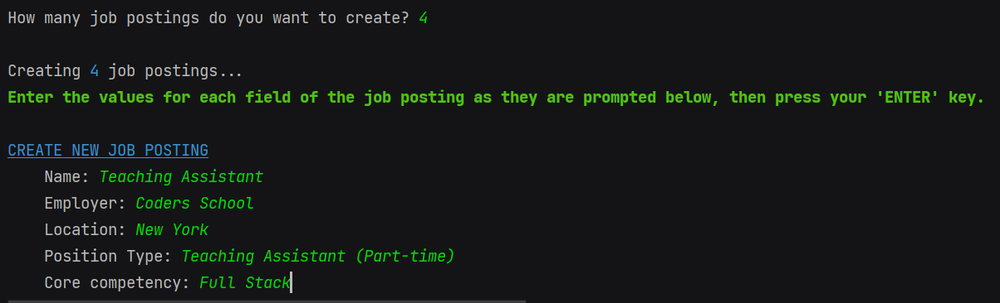
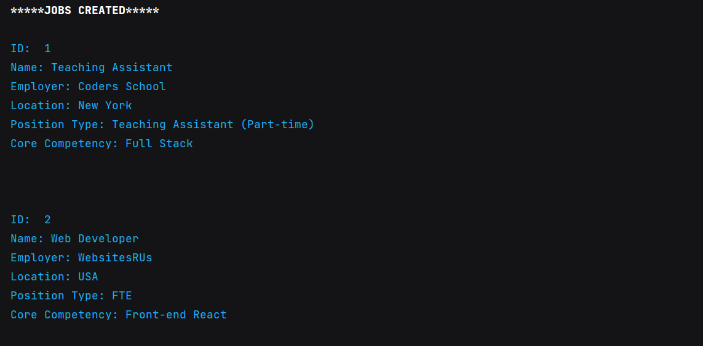

# Tech Jobs OOP

This app is an evolution of [Tech Jobs Console](https://github.com/theodoremoreland/TechJobsConsole). 
It improves upon the design of the original application by implementing object-oriented design (hence the "OOP") and unit testing.
The logic of the original application was abstracted into various classes. This version also has another
significant difference from the original in that it allows the user to create their own
job postings (whereas the original only allowed users to filter and search for preexisting postings).
Look below for a preview via images.

*This was an assignment for LaunchCode's Lc101 2021*

### Technologies
* Java

### Overview
The essence of the abstracting logic into classes can be seen in the image below. The root of each job field (e.g. employer,
location, etc) is coded into an abstract class. Each field then extends the blueprint of that class as to avoid unnecessarily
repeating code. Each job becomes its own object that contains many job fields. Both JobField and Job classes having their own
unit testing suite.

# Images

## Prompts user to enter a number of job postings to be created.

## After the user enters "4".

## User in process of filling out all fields for first posting.

## In process of completing fourth posting.

## After entering all data, app display a list of all postings created.

